#### Jose Felipe Flores da Silva

#### Student number: R00293192

#### [GitHub Repository](https://github.com/JFelipeFloresS/DockerKubernetesCloudAutomationAndOrchestration)

# SECTIONS

- [DEPENDENCIES](#dependencies)
- [USER INPUT](#user-input)
- [RUNNING THE APPLICATION](#running-the-application)
- [FEATURES](#features)
    - [Docker Management](#docker-management)
    - [Kubernetes Management](#kubernetes-management)

<div style="background-color: #ffeb3b; padding: 10px; margin-bottom: 16px; color: black">
<strong>WARNING:</strong>
<br>
I haven't tested this project on Windows, so there might be some differences in commands or paths.
<br>
For this README file, I asked ChatGPT to generate the Windows commands based on the Mac/Linux commands I provided, but I cannot guarantee their accuracy.
</div>

## DEPENDENCIES

This project requires the Python packages listed in the [requirements.txt](requirements.txt) file. You can install them
using pip:

- For Windows:

```bash
pip install -r requirements.txt
```

- For Linux/Mac:

```bash
pip3 install -r requirements.txt
```

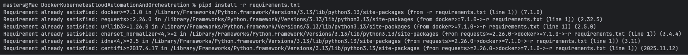

## USER INPUT

This is a command-line application that requires user input during execution. Follow the prompts in the terminal to
provide the necessary information.

When a list is provided, you can either type the value directly or select from the numbered options displayed.
For example, if prompted to select an option from a list:

```
Select an option:
1. Option A
2. Option B
3. Option C
```

You can either type "Option A" or just "1" to select it.

If a default value is provided in the prompt, you can simply press Enter to accept the default.
For example, if prompted:

```
Enter your name [Default: John Doe]:
```

Pressing Enter without typing anything will select "John Doe" as the input.

You can cancel any operation at any time by typing "cancel" and pressing Enter. This will abort the current process and
return you to the main menu or exit the application, depending on the context.

On any inner menu, typing "Main menu" or the corresponding number for the main menu option will take you back to the
main menu.

On any menu, typing "exit" or the corresponding number for the exit option will terminate the application.

## RUNNING THE APPLICATION

To run the application, use the following command in your terminal:

- For Windows:

```bash
python -m src.main
```

- For Linux/Mac:

```bash
python3 -m src.main
```

> **Note:**
>
> The `python` vs `python3` command may vary depending on your system's configuration.

## FEATURES

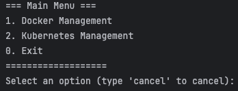

The application provides the following sub-systems:

- Docker Management
    - 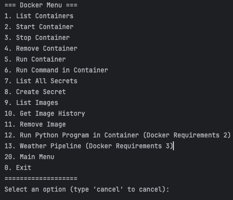
- Kubernetes Management

### Docker Management

The Docker Management sub-system allows you to manage Docker containers and images. You can perform tasks such as:

- List all Docker containers
    - 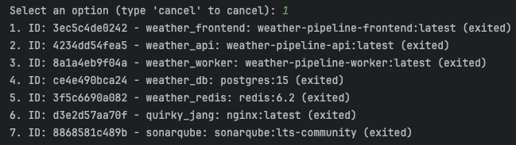
- Start a Docker container
    - 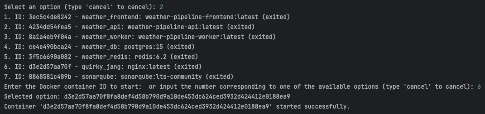
    - 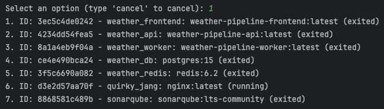
- Stop a Docker container
    - 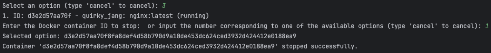
    - 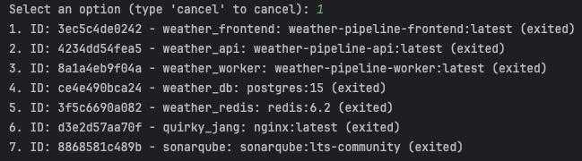
- Remove a Docker container
    - 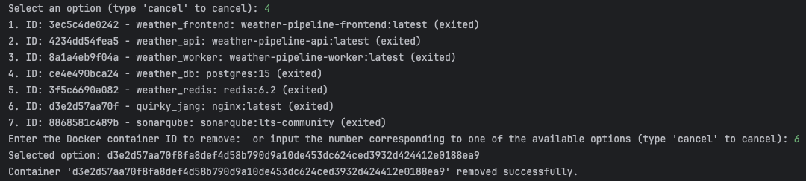
    - 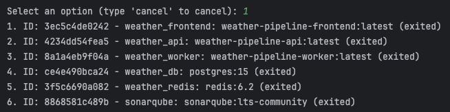
- Run a new Docker container from an image
    - 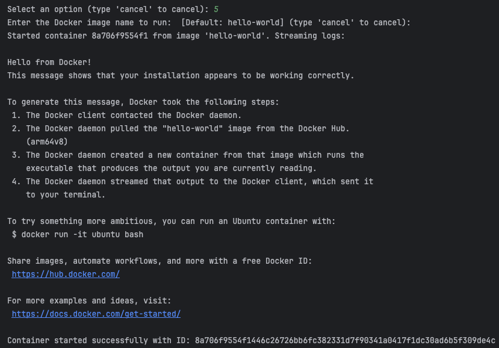
    - 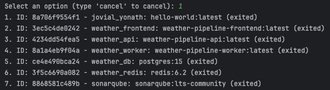
- Run a command inside a Docker container
    - 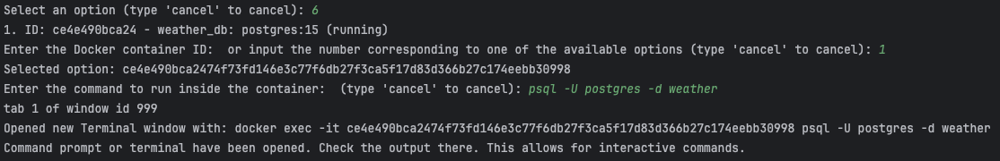
    - 
- List all secrets
    - 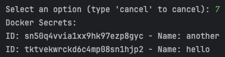
- Create a new secret
    - 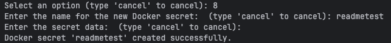
    - 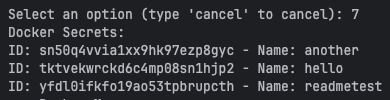
- List all Docker images
    - 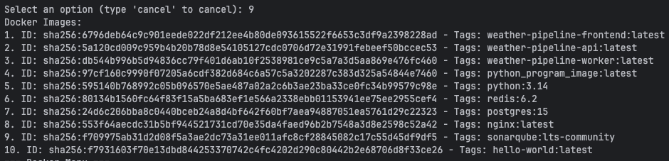
- Get a Docker image's history
    - 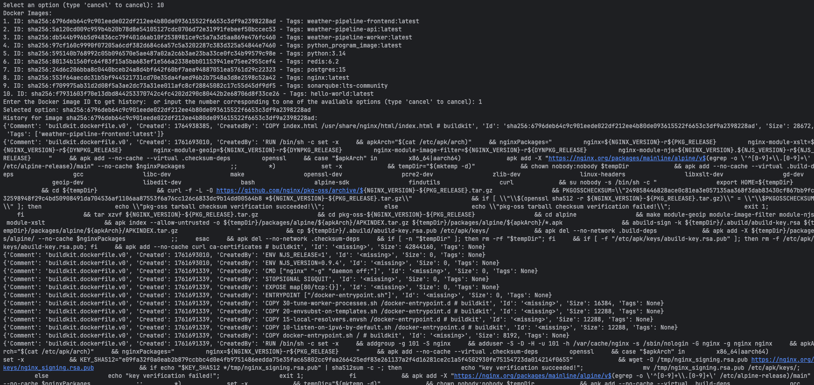
    - 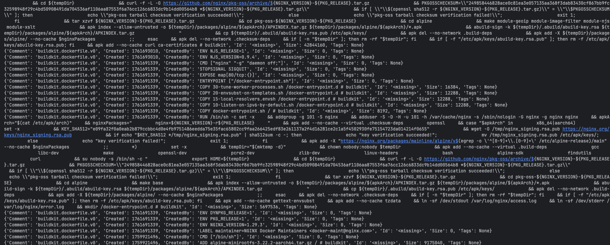
- Remove a Docker image
    - 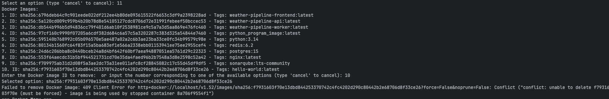
    - 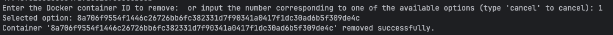
    - 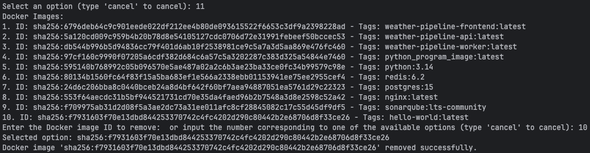
- Run a python program inside a Docker container (Assignment Docker Requirement 2)
    - [Test file](src/assets/test.py)
    - 
- Build and run a Weather Pipeline with Docker (Assignment Docker Requirement 3)
    - 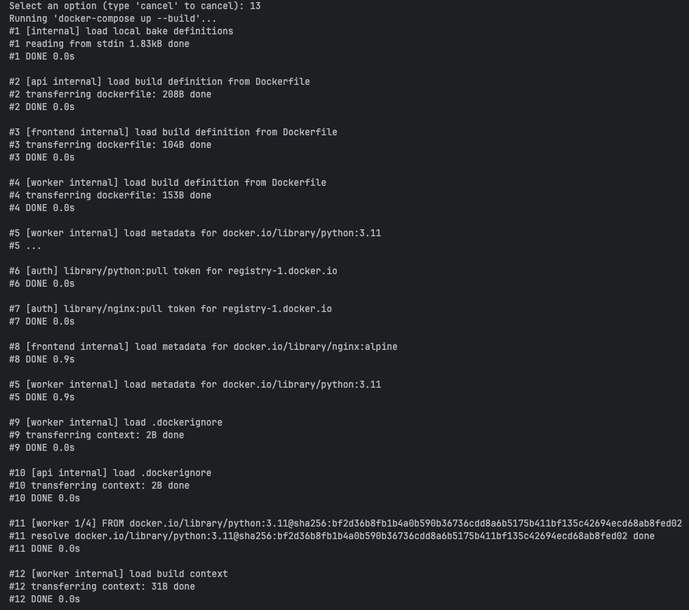
    - 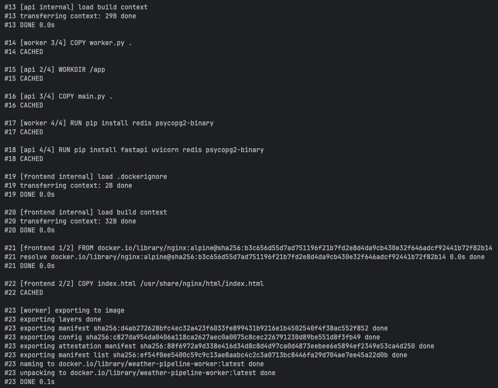
    - 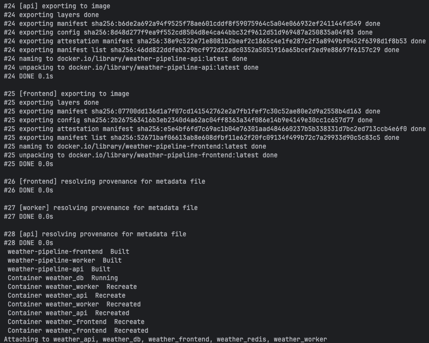
    - 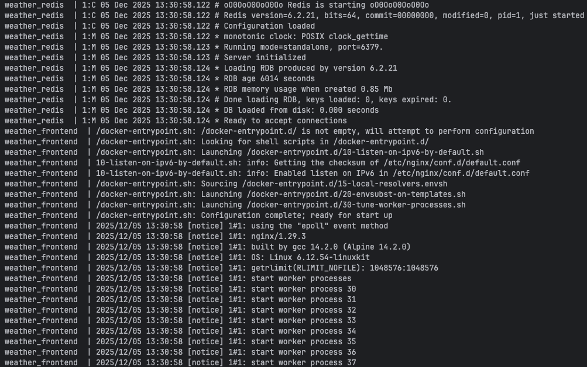
    - 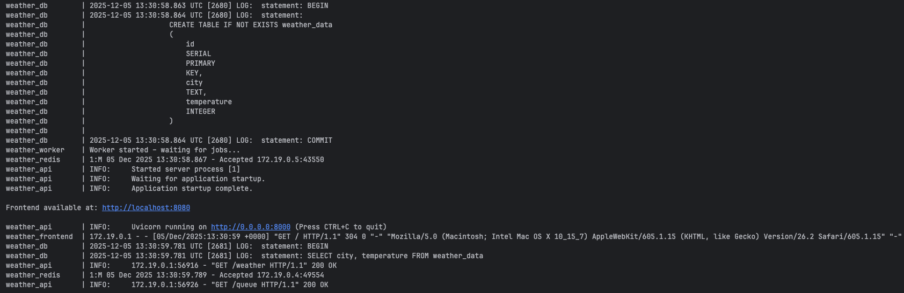
    - Containers are now running: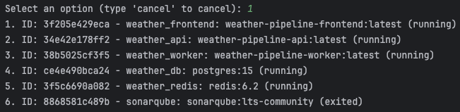
    - Clear frontend: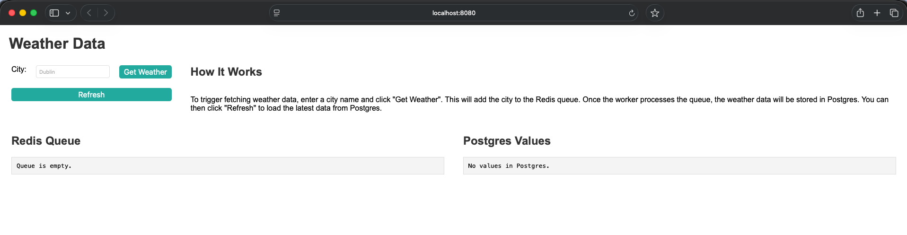
    - Adding new city to Redis queue:
        - Frontend visual cue: 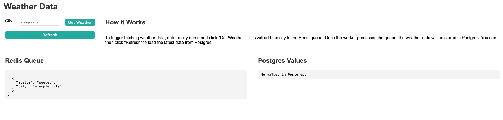
        - Backend worker receiving request and sending it to Postgres straight
          away: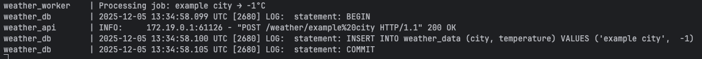
    - After clicking refresh:
        - We can see the queue has been processed in the frontend: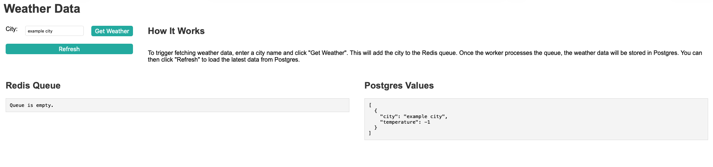
        - Get request in the backend for both the queue and the weather
          DB: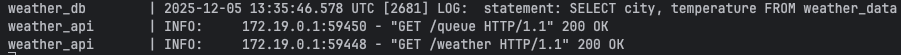
    - A new POST request:
        - Front end displays queue and Postgres values separately: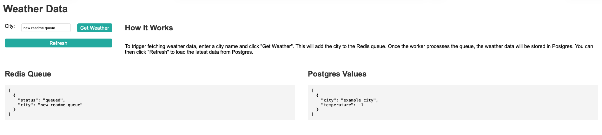
        - New POST request to add item city request to queue + sending it to Postgres straight
          away: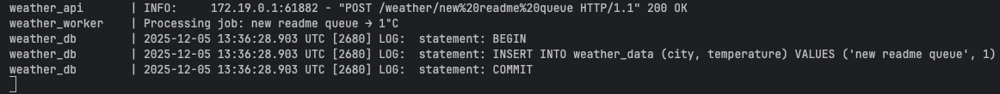
    - If the number of requests was sufficiently high, we would be able to see the queue processing in the backend
      worker as well.
    - By typing ctrl+c in the terminal where the application is running, we can stop all containers:
        - 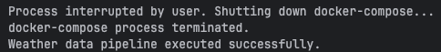
        - 

### Kubernetes Management